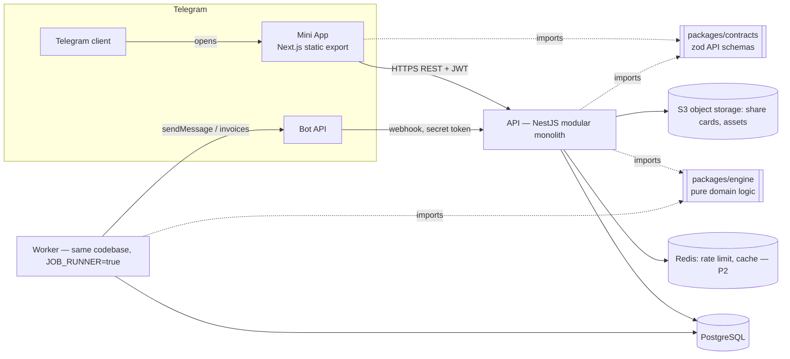
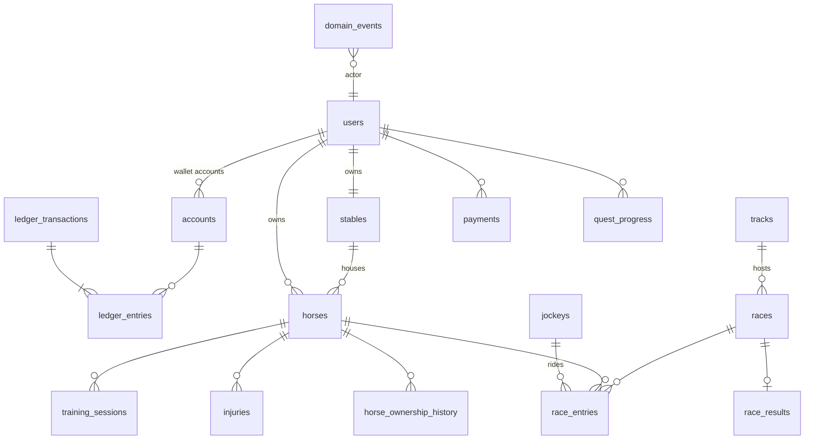

# Technical Architecture

## Overview



* **Modular monolith** (`apps/api`), module boundaries = future service boundaries.
  Modules communicate through services and the `domain_events` outbox, never by
  touching each other's tables directly.
* **`packages/engine`** — pure, deterministic TypeScript: RNG, horse generation,
  genetics, training, condition, race simulation, commentary, ratings, economy config.
  No I/O → trivially unit/simulation-testable and horizontally scalable (race runs are
  CPU-only and can move to a worker pool).
* **`packages/contracts`** — zod schemas shared by API (validation) and web (typing),
  so the contract cannot diverge.
* **Worker** — same image, runs scheduled jobs using Postgres `FOR UPDATE SKIP LOCKED`
  job claiming, so N workers can run safely (no double race runs).

## N. Social System
MVP: shareable result cards (deep link `t.me/<bot>/<app>?startapp=race_<id>`), referral
deep links (`startapp=ref_<code>`), follow favourites. P3: follow graph, activity feed,
clubs (treasury is a ledger account owned by the club), club chat links to Telegram groups.
Privacy: only username/first name and avatar are public; Telegram IDs never exposed.

## O. Telegram Architecture
* **Launch:** Bot menu button / direct link opens the Mini App. `startapp` param routes
  to race, horse, referral.
* **Authentication:** client sends raw `initData`; server validates
  `HMAC_SHA256(key = HMAC_SHA256("WebAppData", botToken), data_check_string)` in
  constant time, rejects `auth_date` older than `TELEGRAM_AUTH_MAX_AGE_SEC`
  (default 24 h) or in the future, upserts the user by Telegram ID and issues a
  short-lived JWT (HS256, 12 h). The client never sends a user id.
* **Bot webhook:** `POST /telegram/webhook` verified with
  `X-Telegram-Bot-Api-Secret-Token` (constant-time compare). Handles
  `pre_checkout_query`, `successful_payment`, `/start`, `/paysupport`, `/help`.
* **Notifications:** outbox → worker → `sendMessage`, respecting per-user
  preferences and Telegram rate limits (30 msg/s global, 1 msg/s per chat).

## P. Payment Architecture

```
PaymentService (domain)                     ── owns payments table + state machine
  └─ PaymentProvider interface
       ├─ TelegramStarsProvider (XTR)      ── digital goods inside Telegram (required by Telegram rules)
       ├─ StripeProvider (stub, disabled)  ── external web checkout, B2B, physical/real-world services only
       └─ FutureProvider
Entitlements: ProductCatalog → grants (ledger post of GEMS / cosmetic items / subscription)
```

Payment state machine: `CREATED → PENDING → COMPLETED → REFUNDED`, `CREATED/PENDING → FAILED|EXPIRED`.

Flow (Stars):
1. `POST /payments` {productId} → server creates `payments` row (CREATED) and an
   invoice link via `createInvoiceLink` with `payload = payment.id`, currency `XTR`.
2. Client opens `Telegram.WebApp.openInvoice(link)`.
3. Bot receives `pre_checkout_query` → validates payment row, product, amount, user →
   `answerPreCheckoutQuery(ok)`; payment → PENDING.
4. Bot receives `successful_payment` → verify payload/amount/currency → in ONE
   transaction: payment → COMPLETED (unique `provider_charge_id`), ledger post
   `idempotency_key = payment:<id>` granting Gems. Duplicate webhooks are no-ops.
5. The client's `invoiceClosed: paid` callback only triggers a refresh — never a credit.
6. Refund (support/admin): `refundStarPayment` → ledger reversal (if balance allows;
   otherwise flag account) → REFUNDED.

`/paysupport` bot command + in-app Payment Support entry (Telegram requirement).

## Q. Database Schema

PostgreSQL 16, plain SQL migrations (`apps/api/migrations/NNNN_name.up.sql` / `.down.sql`)
— full control over CHECK constraints, partial indexes and triggers. MVP tables:



| Table | Notes |
|---|---|
| `users` | telegram_id UNIQUE, role, trust_score, referral_code UNIQUE, referred_by |
| `stables` | owner_id UNIQUE, level CHECK 1–5, reputation |
| `accounts` | (owner_type, owner_id, currency) UNIQUE; CHECK balance ≥ 0 when owner_type='USER' |
| `ledger_transactions` | idempotency_key UNIQUE, type, reason, metadata |
| `ledger_entries` | tx_id, account_id, amount ≠ 0; deferred trigger ensures Σ = 0 per tx |
| `horses` | genome JSONB (immutable), attributes JSONB, condition cols, status CHECK, owner_id NOT NULL unless is_house, sire/dam FKs |
| `horse_ownership_history` | append-only |
| `training_sessions` | status, completes_at, result JSONB, UNIQUE active session per horse (partial index) |
| `injuries` | severity, heals_at, factors JSONB |
| `tracks`, `jockeys` | seed data |
| `races` | class, status state machine, starts_at, seed_hash, seed (revealed), conditions |
| `race_entries` | UNIQUE (race_id, horse_id), UNIQUE (race_id, gate), partial UNIQUE active entry per horse |
| `race_results` | race_id PK (one result per race), frames JSONB, events JSONB |
| `payments` | provider, provider_charge_id UNIQUE, status, product_id, amount |
| `quest_progress` | user onboarding/missions |
| `domain_events` | outbox: type, payload, processed_at |
| `jobs` | scheduler: type, run_at, locked_until, attempts, unique dedupe key |
| `game_config` | versioned admin config |
| `audit_logs` | append-only (admin & security actions) |
| `rate_limits` | P2 → Redis |

Phase-2+ tables (designed, not yet migrated): `facilities`, `staff`, `staff_contracts`,
`market_listings`, `market_bids`, `breeding_events`, `breeding_rights`, `tournaments`,
`tournament_entries`, `seasons`, `season_points`, `clubs`, `club_members`, `items`,
`inventory`, `subscriptions`, `referrals`, `achievements`, `sponsors`, `sponsor_contracts`,
`notifications_prefs`, `hall_of_fame`.

## R. Backend Architecture

```
apps/api/src
  main.ts                 bootstrap (Fastify adapter, helmet-like headers, CORS allowlist)
  config/                 env schema (zod) — process fails fast on invalid config
  common/                 db pool + tx helper, errors, zod pipe, auth guard, rate limit, logger
  modules/
    health/               /health (liveness), /ready (db)
    auth/                 Telegram initData verification, JWT
    users/                /me, profile
    economy/              LedgerService (only writer of balances), wallet API
    stable/               stable, capacity, upgrades
    horses/               horse queries, state machine, condition projection
    training/             start/settle training (idempotent)
    races/                schedule, enter/withdraw, lock, run, results, commentary
    leaderboard/          horse/owner rankings
    payments/             PaymentService + providers, Telegram webhook
    notifications/        outbox consumer → bot messages
    admin/                RBAC-protected ops, config, audit
    jobs/                 job runner (SKIP LOCKED), schedules
```
Rules: controllers are thin; services own transactions; all mutations of economy go
through `LedgerService.post`; every critical mutation is transactional and idempotent.

## S. Frontend Architecture
* Next.js (App Router) with `output: 'export'` → static bundle served from CDN; fully
  client-side, talks to API with JWT. Tailwind CSS, dark-luxury design tokens.
* Telegram WebApp SDK (`telegram-web-app.js`): theme, back button, haptics,
  `openInvoice`, `shareMessage`/deep links.
* State: lightweight fetch hooks with cache (SWR-like), no business logic on client —
  it renders server state only.
* Screens: Home, Horses, Horse profile (tabs), Training, Races (lobby), Race live/replay
  (canvas animation from frames), Rankings, Profile/Wallet, Shop.
* Performance: static assets, code-split per route, no heavy 3D in MVP (SVG/canvas).
