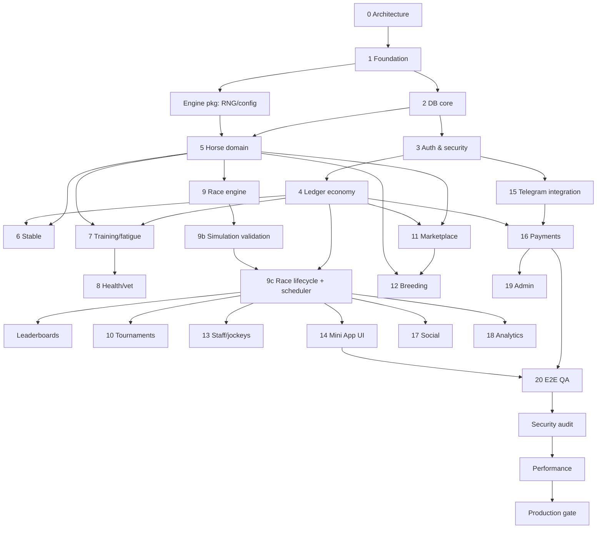

# Delivery Plan — Decomposition, Dependencies, Backlog

Machine-readable state: [`project-state.json`](./project-state.json).

## X. MVP (Milestone M3 "Vertical Slice → MVP")

In scope: Telegram auth, onboarding quests, stable (capacity/levels), horses with full
attribute/genome model, training + fatigue + bounded injuries, scheduled races with
NPC fill, validated race engine, live/replay viewer, results + rewards + ratings,
leaderboards, ledger economy, Gems via Telegram Stars, bot notifications, minimal admin API.

Out of scope for MVP (feature-flagged off): marketplace, breeding UI, tournaments,
clubs, staff hiring, facilities, sponsors, subscriptions, season pass.

## Y. Roadmap & Milestones

| Milestone | Content | Exit gate |
|---|---|---|
| M0 Design | Docs 00–05, dependency graph, state file | Docs committed |
| M1 Foundation | Monorepo, TS strict, lint, tests, engine package, API skeleton, DB + migrations, health | build+lint+tests green, migrations up/down |
| M2 Core domain | Auth, ledger, horses, stable, training, race engine validated | unit+integration green, `sim:races` targets met |
| M3 Vertical slice | Races lifecycle + scheduler, results, leaderboards, Mini App screens, onboarding | E2E journey: auth→horse→train→race→result |
| M4 MVP | Payments (Stars), notifications, admin API, anti-abuse limits, observability | security checklist, load test 10k users |
| M5 Closed beta | Balance tuning from live data, economy dashboard | D1/D7 targets, no P0 bugs |
| M6 Phase 2 | Marketplace, breeding, tournaments/seasons, staff/jockeys, facilities | per-feature gates |
| M7 Phase 3 | Clubs, syndicates, social feed, sponsors, creators, subscriptions, pass | |
| M8 Phase 4 | B2B, external integrations, real-world partnerships | legal review |

## Dependency Graph (systems)

**Critical path:** Architecture → Foundation → DB → Auth → Ledger → Horse → Training →
Race engine → Validation → Race lifecycle → Mini App → Telegram → Payments → QA →
Security → Performance → Production.

Parallelizable (no shared critical files): engine race model ‖ DB/auth work; docs ‖
anything; frontend shell ‖ backend once contracts exist.

## Z. Backlog (task tree)

Format: `ID | Title | Pri | Risk | Cx (1–5) | Depends | DoD`. Status lives in the
state file.

### PHASE 0 — Initialization
| ID | Title | Pri | Risk | Cx | Dep | DoD |
|---|---|---|---|---|---|---|
| 0.1.1 | Functional/non-functional requirements, assumptions | P0 | LOW | 2 | — | docs 00–02 |
| 0.2.1 | System/module/DB/API/payment architecture | P0 | MED | 3 | 0.1.1 | doc 03 |
| 0.2.2 | Security, anti-fraud, analytics model | P0 | MED | 2 | 0.2.1 | doc 04 |
| 0.3.1 | Task tree, dependency graph, critical path, state file | P0 | LOW | 2 | 0.2.* | doc 05 + json |

### PHASE 1 — Foundation
| ID | Title | Pri | Risk | Cx | Dep | DoD |
|---|---|---|---|---|---|---|
| 1.1.1 | pnpm monorepo, TS strict base config, workspaces | P0 | LOW | 1 | 0.3.1 | `pnpm -r build` |
| 1.1.2 | ESLint + Prettier + Vitest wiring, root scripts | P0 | LOW | 1 | 1.1.1 | `pnpm lint && pnpm test` |
| 1.2.1 | `engine`: seeded RNG (sfc32 + cyrb128), math utils | P0 | MED | 2 | 1.1.1 | uniformity + determinism tests |
| 1.2.2 | `engine`: typed config (economy, training, race, lifecycle) | P0 | LOW | 2 | 1.2.1 | config validated by tests |
| 1.3.1 | `api`: NestJS bootstrap, env schema, logger, error filter | P0 | LOW | 2 | 1.1.2 | app boots, /health |
| 1.3.2 | DB pool, tx helper, SQL migration runner (up/down) | P0 | MED | 2 | 1.3.1 | migrate up/down/up in test |
| 1.3.3 | docker-compose (postgres, redis), CI workflow | P1 | LOW | 1 | 1.3.2 | CI green |

### PHASE 2 — Database core (MVP tables)
| 2.1.1 | Migration 0001 identity/economy (users, stables, accounts, ledger, audit, config, events, jobs) | P0 | HIGH | 3 | 1.3.2 | constraints tested (Σ=0, balance≥0) |
| 2.1.2 | Migration 0002 horses (horses, history, training, injuries) | P0 | MED | 3 | 2.1.1 | FK/check tests |
| 2.1.3 | Migration 0003 racing (tracks, jockeys, races, entries, results) + seeds | P0 | MED | 3 | 2.1.2 | unique entry/gate tests |
| 2.1.4 | Migration 0004 payments, quests | P0 | MED | 2 | 2.1.1 | idempotency uniques |

### PHASE 3 — Auth & security
| 3.1.1 | Telegram initData verifier (pure fn) | P0 | CRIT | 2 | 1.3.1 | vectors: valid, tampered, expired, future |
| 3.1.2 | /auth/telegram → upsert user, starter grant (idempotent), JWT | P0 | HIGH | 3 | 3.1.1, 4.1.1 | integration test |
| 3.1.3 | Auth guard, roles guard, rate limiter, zod pipe | P0 | HIGH | 2 | 3.1.2 | 401/403/429 tests |

### PHASE 4 — Ledger economy
| 4.1.1 | LedgerService.post (lock order, idempotency, Σ=0) | P0 | CRIT | 4 | 2.1.1 | concurrency test: 50 parallel debits never negative |
| 4.1.2 | Wallet API, transaction history | P1 | LOW | 1 | 4.1.1 | API test |

### PHASE 5 — Horse domain
| 5.1.1 | engine: genome, attribute model, horse generator (rarity/quality bands) | P0 | MED | 3 | 1.2.2 | distribution tests |
| 5.1.2 | engine: ability rating, lifecycle/age, condition projection (fatigue/health/form) | P0 | MED | 3 | 5.1.1 | unit tests |
| 5.1.3 | engine: state machine | P0 | LOW | 1 | 5.1.1 | illegal transitions rejected |
| 5.2.1 | api: HorsesService/repo, starter horse, list/detail (owner scoping) | P0 | MED | 3 | 5.1.*, 2.1.2 | IDOR test |

### PHASE 6 — Stable
| 6.1.1 | Stable create/capacity/upgrade (ledger sink) | P1 | LOW | 2 | 4.1.1, 5.2.1 | tests |

### PHASE 7 — Training
| 7.1.1 | engine: training outcome fn (gains, fatigue, injury), bounded & explainable | P0 | MED | 3 | 5.1.2 | property tests (never exceeds ceiling, never negative) |
| 7.2.1 | api: start training (cost, status, lock), settle (idempotent), job | P0 | HIGH | 3 | 7.1.1, 4.1.1 | concurrency test (double start rejected) |

### PHASE 8 — Health
| 8.1.1 | Injury heal projection, vet treatment (ledger sink) | P1 | LOW | 2 | 7.2.1 | tests |

### PHASE 9 — Race engine & races
| 9.1.1 | engine: tracks, weather/going, conditions model | P0 | MED | 2 | 1.2.2 | unit |
| 9.1.2 | engine: tick simulation (pace, energy, traffic, turns, start, kick) | P0 | CRIT | 5 | 9.1.1, 5.1.2 | determinism, invariants |
| 9.1.3 | engine: events + commentary + frames | P0 | MED | 2 | 9.1.2 | events consistent with frames |
| 9.1.4 | engine: Elo race rating, prize split | P0 | LOW | 1 | 9.1.2 | unit |
| 9.2.1 | Simulation validation harness (10k/100k/1M) + CI subset | P0 | HIGH | 3 | 9.1.2 | §I.4 targets met |
| 9.3.1 | api: race scheduler (generate per class/track), NPC fill, lock, run (SKIP LOCKED, idempotent) | P0 | CRIT | 4 | 9.2.1, 4.1.1 | restart-safety test |
| 9.3.2 | api: enter/withdraw (fee, eligibility, gate), results, rewards, fatigue/form update | P0 | CRIT | 4 | 9.3.1 | double-entry + double-reward tests |
| 9.4.1 | Leaderboards (horse rating/earnings, owner) | P1 | LOW | 1 | 9.3.2 | API test |

### PHASE 14/15 — Mini App & Telegram
| 14.1.1 | Web shell: Next export, Tailwind tokens, Telegram SDK, API client | P0 | LOW | 2 | contracts | builds |
| 14.1.2 | Screens: Home, Horses, Horse, Train, Races, Race viewer, Rankings, Wallet | P0 | MED | 4 | 14.1.1, 9.3.2 | manual + e2e smoke |
| 15.1.1 | Bot webhook (secret), /start deep links, referral capture | P0 | HIGH | 2 | 3.1.2 | tests |
| 15.1.2 | Notifications consumer (outbox → sendMessage) | P1 | MED | 2 | 15.1.1 | tests w/ fake bot |

### PHASE 16 — Payments
| 16.1.1 | PaymentService + provider interface + product catalog | P0 | CRIT | 3 | 4.1.1 | state machine tests |
| 16.1.2 | TelegramStarsProvider: invoice link, pre-checkout, successful_payment, refund | P0 | CRIT | 3 | 16.1.1, 15.1.1 | duplicate webhook test |

### PHASE 19/20 — Admin, QA, security, performance
| 19.1.1 | Admin API: user lookup, adjust balance (audited), suspend, refund | P1 | HIGH | 2 | 16.1.* | RBAC tests |
| 20.1.1 | E2E API journey test | P0 | MED | 2 | all MVP | green |
| 20.2.1 | Security checklist review | P0 | HIGH | 2 | 20.1.1 | no criticals |
| 20.3.1 | Load test script (k6/autocannon) | P1 | MED | 2 | 20.1.1 | p95 < 200 ms @ target |

### Phase 2+ epics (to be decomposed at M5)
Marketplace (11), Breeding (12), Tournaments/Seasons (10), Staff & Jockeys (13),
Facilities, Nutrition/Equipment, Clubs & Syndicates, Social feed, Sponsors, Subscriptions,
Season pass, Creator economy, AI trainer assistant, Economy dashboard, Risk scoring.

## Complexity per module (MVP)

| Module | Cx | Risk | Main risk |
|---|---|---|---|
| Race engine | 5 | CRIT | believability/balance |
| Ledger | 4 | CRIT | double spend / negative balance |
| Race lifecycle & scheduler | 4 | CRIT | duplicate runs / rewards |
| Payments | 3 | CRIT | crediting without payment |
| Auth | 2 | CRIT | forged identity |
| Training | 3 | HIGH | exploit loops |
| Horse domain | 3 | MED | stat inflation |
| Mini App | 4 | MED | UX clarity |
| Breeding (P2) | 4 | HIGH | genetic inflation |
| Marketplace (P2) | 4 | CRIT | concurrency, wash trading |

## Definition of Done (every task)
code implemented · typecheck · lint · tests (unit/integration as applicable) ·
security considerations reviewed (authz, input validation, idempotency) · edge cases ·
DB integrity constraints · docs updated · no known critical bug.

## Assumptions (recorded, configurable)
1. Working title "Thoroughline". 2. Credits not purchasable (legal/P2W). 3. 1 game year =
28 real days. 4. Races every 10 min per active class in MVP (config). 5. House (NPC) horses
fill fields to min 6, max 12. 6. JWT sessions 12 h; client re-auths from initData.
7. Postgres-backed job queue in MVP (Redis/BullMQ later if needed).
